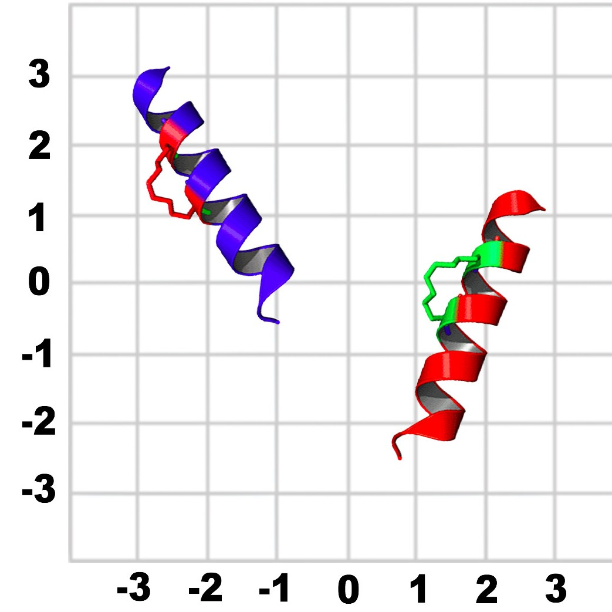
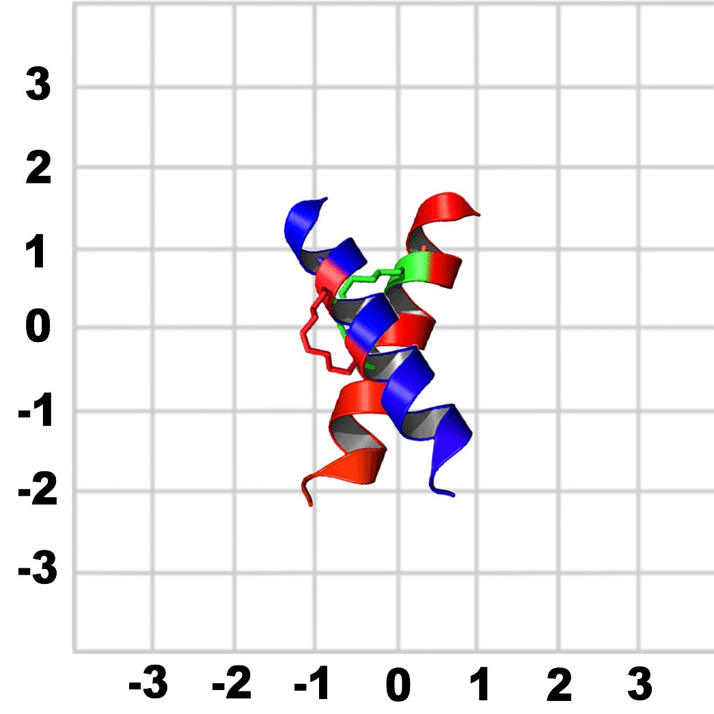
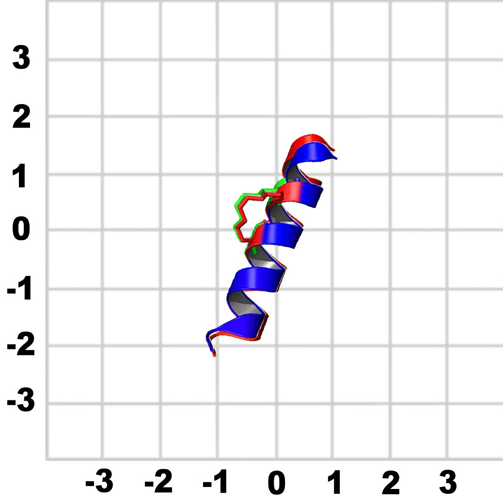
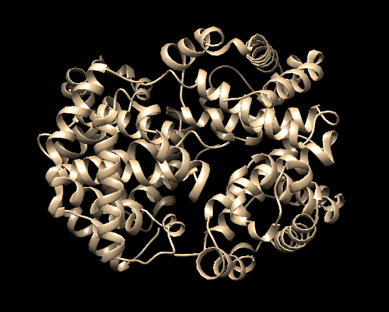
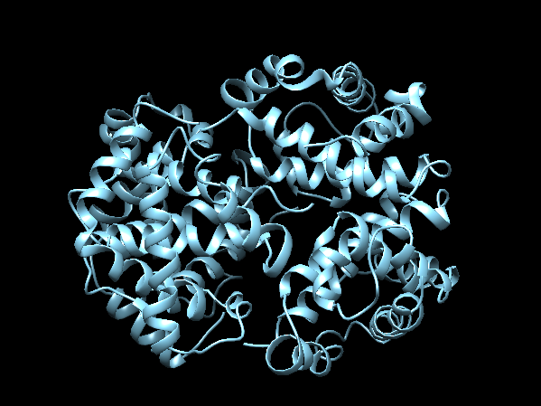
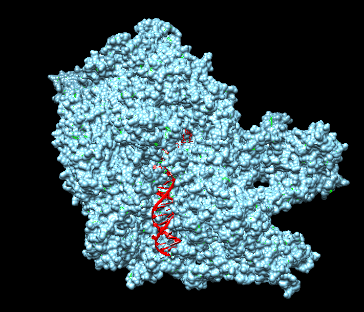
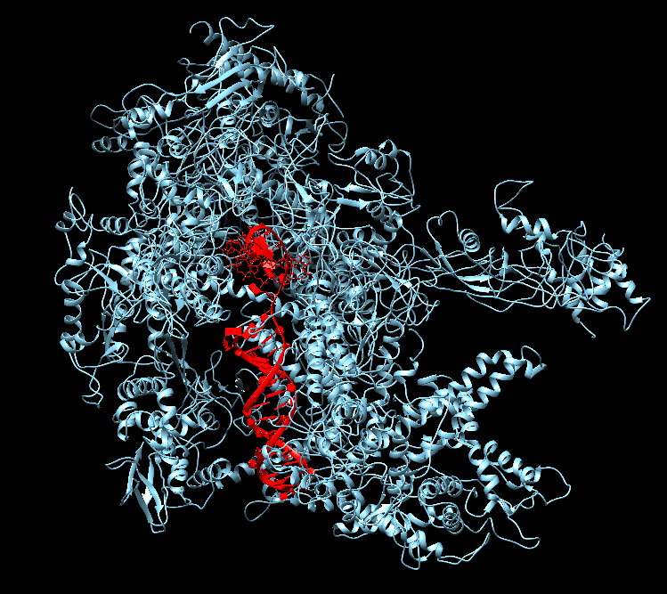

# ANAMM (Amino-Nucleic Acid Macrocomplex Modeler)
## TABLE OF CONTENTS

- [DESCRIPTION](#DESCRIPTION)
- [BACKGROUND](#BACKGROUND)
  * [LIMITATIONS](#LIMITATIONS)
  * [OTHER APPROACHES ](#OTHER-APPROACHES)
- [INSTALLATION](#INSTALLATION)
- [REQUERIMENTS](#REQUERIMENTS)
  * [MANDATORY](#MANDATORY)
  * [OPTIONAL (HIGHLY RECOMMENDED)](#OPTIONAL-(HIGHLY-RECOMMENDED))
- [ALGORITHM](#ALGORITHM)
  * [WORKFLOW](#WORKFLOW)
  * [ARGUMENTS](#ARGUMENTS)
  * [CODE LIMITATIONS](#CODE-LIMITATIONS)
  * [FUTURE CODE IMPROVMENT](#FUTURE-CODE-IMPROVMENT)
- [EXAMPLES](#EXAMPLES)
  * [1GZX](#1GZX)
  * [5FJ8](#5FJ8)

## DESCRIPTION
The function of this program is to reconstruct biological macrocomplexes. It can build them using protein-DNA/RNA interactions as well as protein-protein interactions. The input is a set of binary interactions and the desired number of chains of the target complex. Moreover, you can add extra arguments, as RMSD treshold. This program needs as input the folder where the input files are, and you have to select an output directory to save the output files. If you do not select the output folder, the program automatically will create one.

## BACKGROUND
An important problem in protein structure determination and modeling is to position a given group of protein structures in three-dimensional space once they are determined, i.e., protein structure superposition or alignment. The structures may be determined for the same protein but at different times, such as those obtained in NMR structure determination. It is then important to find the best superimposition for the structures, one that truly reflects the dynamic changes of the structures over time. The structures may also refer to different proteins, such as those obtained for mutated proteins or proteins from a specific gene family. It is then critical to find the best alignment for the structures, in order to reveal some shared structural or functional motifs among the structures.

The aim of this project is to, given molecules of DNA or proteins that are interacting with each other, make a program that generates macro complexes. In order to achieve it, we would create an algorithm that uses a value named RMSD to build that macro complex.  

A conventional approach to superimposing a group of structures is to translate and rotate the structures so that the arithmetic average of the coordinate differences of the corresponding atoms in the structures, called the root-mean-square deviation of the structures, is minimized. Here, the best superimposition of the structures is obtained when the minimal possible root-mean-square deviation is reached. The latter is called the RMSD value of the structures and is used as a measure of the similarity of the structures. RMSD can be calculated for any type and subset of atoms; for example, Cα atoms of the entire protein, Cα atoms of all residues in a specific subset (e.g. the transmembrane helices, binding pocket, or a loop), all heavy atoms of a specific subset of residues, or all heavy atoms in a small-molecule ligands. For obtaining the RMSD value we have this formula: 

<p align="center">
  
</p>

RMSD values are presented in Å and calculated by where the averaging is performed over the n pairs of equivalent atoms and di is the distance between the two atoms in the i-th pair. In DNA interactions we can use P, C2′ and C4' atoms. All three DNA atoms appear in any nucleotide, regardless of type (A, C, G or T). The P atom is situated in the DNA backbone, C2′ in the DNA sugar ring, and C4' is in the nucleobase. This allows for easy computations of the RMSD between DNA molecules containing the same number of nucleotides but different sequences. In our particular case, ANAMM calculates the RMSD of the Cα atoms if there is a protein-protein interaction, and the RMSD of the C4' for the DNA/RNA interactions. In order to understand better this technique, we would make an example: 

| No Changes | Re-centered | Rotated | 
| ------------- | ------------- | ------------- |
|  |  |  |

You have molecule A and B and want to calculate the structural difference between those two. If you just calculate the RMSD straight-forward you might get a too big of a value. For that reason, you would need to first recenter the two molecules and then rotate them unto each other until you get the true minimal RMSD. ANAMM performs this approximation with several chains (if the input have more than two chains) looking for the lowest RMSD values between chains.
But that is not the end of the story since, not every conformation of chains should be allowed. This is due to the rotation angles of the side chains (psiand psi) that as we know thanks to the Ramachandran plot, tend to concentrate their probability arround certain conformations. The explanation behind this is on the phenomena of clashing, where the space of an atom invades another. As it can be seen in the plot, the Van der Waals weak energy is distance dependent, and when two atoms are too close, the energy rises very quickly due to repulsion, making the complex unfavorable and in general unfeasible (since a clashing protein would not exist). Thus when superimposing two chains the program will check if there is clashing between the sidechains.

| Van der Waals forces | Clashes and atom radius |
| ---------- | ---------- |
|  |  |


### LIMITATIONS
This approach have some limitations: 
- Calculates only structures with the same number of atoms. 
- Has a low flexibility: Scale bad the cases that two structures that are identical with the exception of a position of a single loop or a flexible terminus typically have a large global backbone. This is not a particular case about our program, it happens to any algorithm that optimizes the global RMSD.
- Any kind of RMSD-based measurement requires prior assignment of atom correspondences.
- GUI interface is not develop yet

### OTHER APPROACHES 
This program uses the common way to build a macro complex, that as we have explained before is called the root-mean-square deviation (RMSD). But there are other approaches that we will briefly explain: 

1. **G-RMSD**: Generalized Root Mean Square Deviation (G-RMSD) method calculates the minimal RMSD value of two atomic structures by optimal superimposition. G-RMSD is not restricted to systems with an equal number of atoms to compare or a unique atom mapping between two molecules. The method can handle any type of chemical structures, including transition states and structures which cannot be explained only with valence bond (VB) theory (non-VB structures). It requires only Cartesian coordinates for the structures.
2. **Dynamically weighted RMSD**: This approach takes into account the weight of the different molecules. Different atoms may have different properties and they should be compared differently. For this reason, when superimposed with RMSD, the coordinate differences of different atoms should be evaluated with different weights. This method the thermal motions of the atoms can be obtained from several sources such as the mean-square fluctuations that can be estimated by Gaussian network model analysis. 
3. **RMS of dihedral angles**: An approach complementary to Cartesian backbone RMSD is based on the representation of the protein structure in the internal coordinates that include bond lengths, planar bond angles, and dihedral torsion angles.
4. **Global Distance Test (GDT)**: As described above, RMSD heavily depends on the precise superimposition of the two structures and is strongly affected by the most deviated fragments. GDT ( used for CASP model evaluation) performs multiple superimpositions, each including the largest superimposable subset for one of the residues,  between the two structures. The output of a GDT calculation represents a curve that plots the distance cutoff against the percent of residues that can be fitted under this distance cutoff. A larger area under the curve corresponds to more accurate prediction.

This does not mean that one approach is better than the other. All approaches have their pros and cons, but for future versions of the program it is important to take into account all possible improvements, because some of this approaches could solve some actual limitations that our tool presents. 

## INSTALLATION

The package can be downloaded using Git:
```
 git clone https://github.com/Albert-is-an-undefined-variable/ANAMM
 cd ANAMM
```
Then, it can be installed (optional) via setup.py:
```
 python3 setup.py install
```
## REQUERIMENTS
### MANDATORY
The following versions of packages/modules must be installed in order to run our program properly:
- Python v3.8.3 (Notice this is the version we used, older versions migth also work)
       modules: Sys, Os.
- Biopython v1.78
- Argparse v1.1
       
### OPTIONAL (HIGHLY RECOMMENDED) 
In order to be able to use the optimization algorithm, the user must download modeller package. MODELLER is a package that is used for homology or comparative modeling of protein three-dimensional structures. To download MODELLER using conda you have to do the following: 

```
conda config --add channels salilab
conda install modeller
```
After that you have to visit:  https://salilab.org/modeller/

There, you have to ask for a MODELLER license key. It is recommended to give your official academic email address rather than a home email address. This license key is free only to academic non-profit institutions. Once you have obtained the license, you have to go to the following file and add it: 

```
/path_to_modeller/../../modeller/config.py
```
If you wan tto download it without using conda, you can visit the modeller package website to further instructions. 

## ALGORITHM
### WORKFLOW
ANAMM builds a macro-molecular complex given a set of binary protein-protein or RNA/DNA-protein interactions. This approach is performed by means of a recursive function. When the program is executed, the recursive function will loop iteratively through the list of files present in the input directory. Then, it will perform all the possible superimpositions between the two chains from the sample structure and all the chains from the reference file searching for the best superimposition model. After that, in each iteration it will add a chain and it will repeat the process until it builds a macro complex. This superimposition is only made if the number of CA, for proteins, or C4’, for nucleic acids, atoms, obtained with the Key_atom_retriever function, is the same in both chains, and also if they are the same kind of molecule, i.e., DNA, RNA or PROTEIN.

The script execution finishes when the number of chains of the complex equals the number of chains specified in the stoichiometry argument. If the user does not add this argument, ANAMM will stop after all the files have been processed once without adding any new chains to the complex. 

It is important to add the stoichiometry argument if we know the final number of chains of the macro complex because it will improve the efficiency of the algorithm. Another argument that is important to add is the optimize argument. This would allow an improvement of the macro complex output file. This option would not modify the workflow of the algorithm because it is launched once the program has already obtained the pdb final file. There are other arguments that we can include when we execute ANAMM and there are explained better in the arguments section. 


### ARGUMENTS
Command-line arguments
-  ```-h```, ```--help```: this flag will show the usage of the program as well as a description of what it does as well as an explanation of all the parameters it has and can modify or offer some information when executing the program.
- ```-i```, ```--indir```: this argument is required can either be an absolute or relative path of the input folder containing all the binary-interaction PDB files that are going to be used to build the complex.
- ```-o```, ```--outdir```: this argument is optional and if set, all the output files will be saved in this folder. If not set, by default, the output files will be saved in a folder named: input_foldername_output.
- ```-v```, ```--verbose```: this argument is optional and will print the progression log in the standard error if set.
- ```-pi```, ```--pdb_iterations```: this argument is optional and will save a new PDB file every time a chain is added to the complex if set.
- ```-ste```, ```--number_chains```: this argument is optional and if set indicates the number of chains the user wants the final complex to have. If not, it will take a value of 100 by default.
- ```rmsd```, ```--rmsd_threshold```: this argument is optional and if set, the RMSD threshold will take its value. If not, it will take a value of 0.3 by default.
- ```cl```, ```--clashes_theshold```: this argument is optional and if set, the clashes threshold will take its value. If not, it will take a value of 30 by default.

### CODE LIMITATIONS
- ANAMM process better small macrocomplexes than bigger ones because the recursive algorithm that has. When it has to build a big macrocomplex, it took some time to do it
- Stechiometry and optimization arguments are very important in order to reach a good model if we have big macrocomplexes. In small macrocomplexes, if we use only the core function without any optional arguments, the program construct a good model. But if we want to make a big one, we would need this extra arguments. In the examples part we can see this
- ANAMM crashes if we have a final PDB macrocomplex bigger than 99.999 atoms because pdb file can not contain more than 99.999 atoms. If this happen, the stechiometry argument does not work. To solve that, we have create a post_optimize.py that allows the user optimize the final pdb in this particular case. This script can be used with any pdb that we want to improve. is highly recommended to use -ste argument to avoid this crash. 
### FUTURE CODE IMPROVMENT
- Functions could be further splitted
- More use of one-liners (the pythonic way)
- Use of generator functions instead of lists (memory costs)
- Use of composition over inheritance (since in python everything is an object, the easy  to adapt existent code to our program purposes providing  flexibility, but this has a drawback and it's that since the program works adding new features on top of predefined functions, if something needs to be modified its a bit messy (hindering code mantainance), so adding more composition to our code could make this task easier)
## EXAMPLES
Here we would make a tutorial with some examples. This proces can be replied by the user. You will find the different pdbs in the examples folder. 
### 1GZX
This structure is a T State Haemoglobin with Oxygen Bound at All Four Haems. The cooperative binding of oxygen by haemoglobin results from restraints on ligand binding in the T state. The unfavourable interactions made by the ligands at the haems destabilise the T state and favour the high affinity R state. The T <==> R equilibrium leads, in the presence of a ligand, to a rapid increase in the R state population and therefore generates cooperative binding. 

We have made these steps to achieve the final structure. The several input files are in the examples folder in case you want to repeat the steps: 

```
> MC_builder -i 1gzx/ -out -1gzx_out/ -opt
```
In this case we have added the optimize argument. What this means is that after the creation of the pdb file, the program would optimize it using MODELLER package and it will return an optimize.pdb

| Standard Output | Optimize Output |
| ------------- | ------------- | 
|  |  | 


ANAMM has a good performance with this example. The optimization file and the output file do not differ a lot, but is it true that the optimization file has less energy than the output file. 


### 5FJ8
Structure of yeast RNA polymerase III elongation complex. Transcription of genes encoding small structured RNAs such as transfer RNAs, spliceosomal U6 small nuclear RNA and ribosomal 5S RNA is carried out by RNA polymerase III (Pol III), the largest yet structurally least characterized eukaryotic RNA polymerase. 

```
> MC_builder.py -i 5fj8/ -out 5fj8_out/ -ste 17 -opt
```

-ste argument allows you to add the stoichiometry of the model representing the total number of chains that you want from your macrocomplex model. The -opt argument is to optimize the model and the energy. In the following pictures we would put only the optimize model: 

| Surface | Optimize Output | 
| ------------- | ------------- | 
|  |  |

The optimized model has reduced the energy of the model by 4500% in comparison with the ANAMM's standard output. In big models, the optimization argument is very useful as we can see. It is important to add the stoichiometry argument if we know the final number of chains of the macro complex, because the algorithm performs better with this argument. 

In the pictures we can see that the RNA fits perfectly inside the RNA polymerase. Moreover, in the next figure, we can see that the DNA is opened due to the transcription process, where polymerase transcribes DNA into RNA. 

### Transcription

<p align="center">
  
</p>


## REFERENCES 
We have extract some of the information about protein-protein interaction superimposition, RMSD value and things related to this project from this references: 
- Bottaro, S., Di Palma, F., & Bussi, G. (2014). The role of nucleobase interactions in RNA structure and dynamics. Nucleic Acids Research, 42(21), 13306–13314.
- Garcia‐Garcia, J., Bonet, J., Guney, E., Fornes, O., Planas, J., & Oliva, B. (2012). Networks of Protein Protein Interactions: From Uncertainty to Molecular Details. Molecular Informatics, 31(5), 342-362.
- Kufareva, I., & Abagyan, R. (2012). Methods of protein structure comparison. Methods in Molecular Biology (Clifton, N.J.), 857, 231–257.
- Wu, D., & Wu, Z. (2010). Superimposition of protein structures with dynamically weighted RMSD. Journal of Molecular Modeling, 16(2), 211–222.
